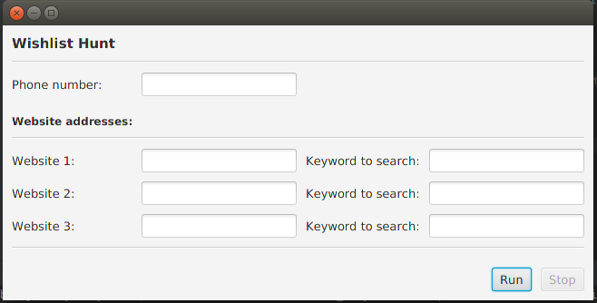

<h1>Wishlist Hunt App</h1>
<h3>Description</h3>

A personal project. This app scrapes the website which links are given in the UI, periodically looking for keywords that are given in the UI. When keywords are found in the website, user will be notified via sms message to check the website that caught the keyword. 
This is useful when user wants to look for a new product that is planned to come online to be sold but not yet online.
 
Image of the UI v1.0 is like this:

 
<h3>Future adds on</h3>
<ul>
<li>Adding time scale to scrape, eq. 1 week, 1 month, etc.</li>
<li>Adding alert when radio button is not selected whils the accompanying fields are filled</li>
<li>Adding automatic shutdown when time scale is reached</li>
</ul>
 

This readme will be updated frequently as project is carried on

